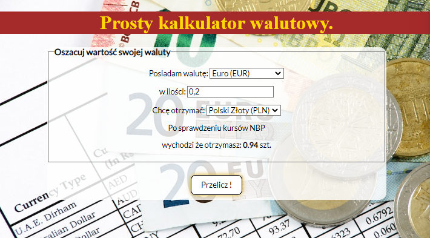

# Currency converter

It's a simple currency converter. 
Language of site is Polish.

## Demo

You can chceck there -> [Currency converter](https://helkapl.github.io/currency-converter/)

That's how it's look like.

## Technologies
- HTML
- CSS
- JavaScript (ES6+)